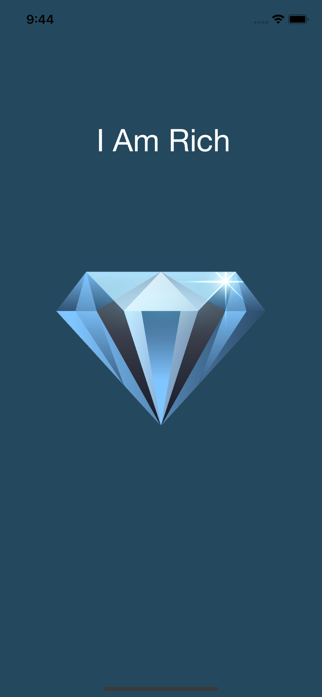

# I am Rich

## Objetivo || Goal

O objetivo deste aplicativo é apresentar os principais conceitos de programação voltadas apenas a inicialização de um projeto com o XCode.

The application objective is to present the main concepts of this programming aimed only at starting a project with XCode.

## O que foi criado? || What was created?

Foi criado um aplicativo com o nome de "I am Rich" que se trata apenas de um app que mostra a imagem de um diamante, não possuindo nenhuma funcionalidade ou interação, apenas para fins de inicialização de projeto.

An app named "I am Rich" was created which is just an app that shows the image of a diamond, having no functionality or interaction, just for project initialization purposes.

## O que foi aprendido? || What was learned?

### Português

* Como iniciar um projeto do zero utilizando o Xcode.
* Como adicionar imagens no app.
* Como adicionar icone e splash screen.

### English

* How to start a project from scratch using Xcode.
* How to add images in the app.
* How to add icon and splash screen.

## Prints

>This is a companion project to The App Brewery's Complete App Development Bootcamp, check out the full course at [www.appbrewery.co](https://www.appbrewery.co/)
